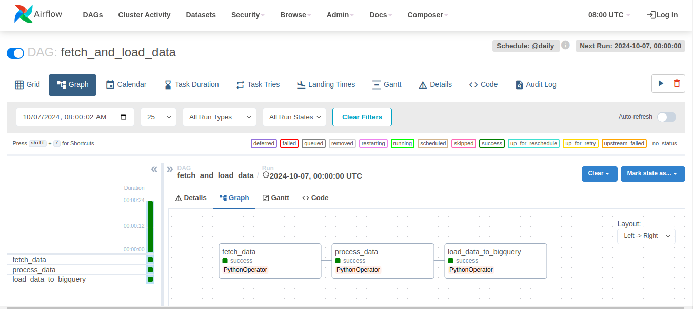

# BlablaCar Case Study

## Overview
This project fetches transportation data from the OVAPI endpoint and loads it into a Google BigQuery table. It processes the data to ensure it includes relevant information such as transport type, line name, load date, and an updated timestamp.

## Prerequisites
- Python 3.10 or higher
- Google Cloud SDK configured with BigQuery access
- Virtual environment tool (like `venv`)

## Setup

1. **Create a Virtual Environment**

Start by creating a virtual environment for your project:
```bash
python3.10 -m venv ~/api-transport-netherlands
source ~/api-transport-netherlands/bin/activate 
```

Install the necessary packages by running:
```bash
pip install -r requirements.txt
```

## Script Overview

### Key Components

#### Data Fetching
The script fetches data from the OVAPI endpoint using the `requests` library.

#### Data Processing
The fetched data is processed into a structured format. Each record includes:
- **id**: Unique identifier for the transportation line.
- **transport_type**: Type of transportation (e.g., BUS).
- **line_name**: Name of the transportation line.
- **line_public_number**: Public number of the line.
- **data_owner_code**: Code for the data owner.
- **destination_name_50**: Destination name.
- **line_planning_number**: Planning number for the line.
- **line_direction**: Direction of the line.
- **load_date**: Randomly generated date within the last 180 days.
- **updated_at**: Timestamp of when the data was last updated.

#### Data Loading
The processed data is loaded into a Google BigQuery table. The script checks for existing records to ensure idempotency, preventing duplicates.

### Orchestration with Airflow
We successfully orchestrated the entire process using Apache Airflow, enabling efficient and idempotent data insertion.

